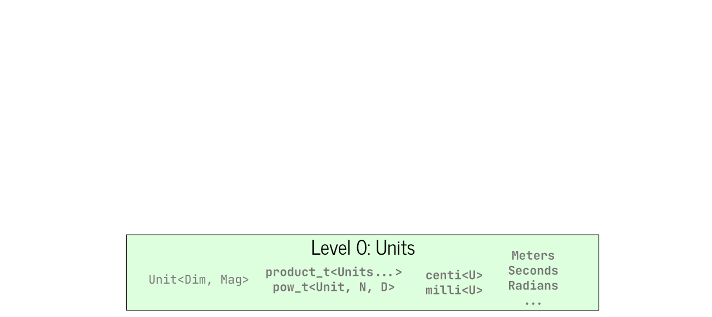
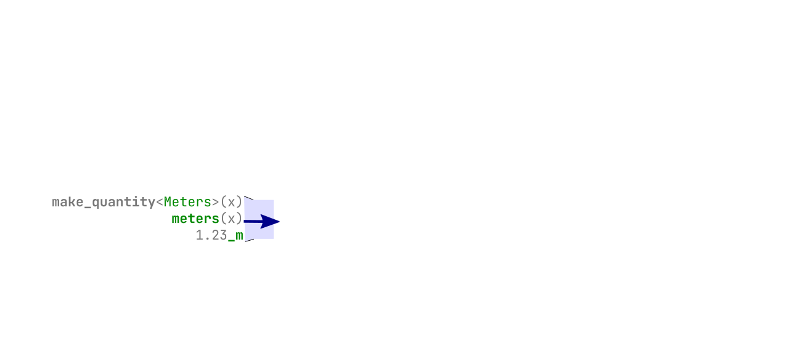
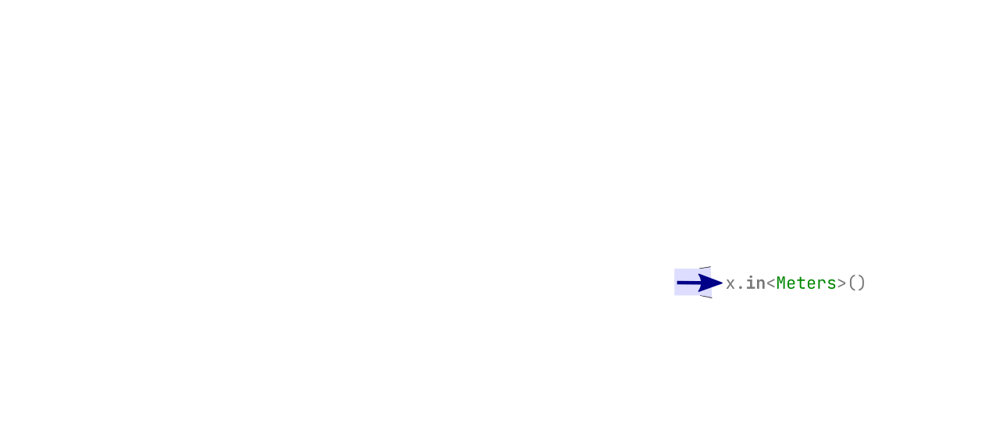
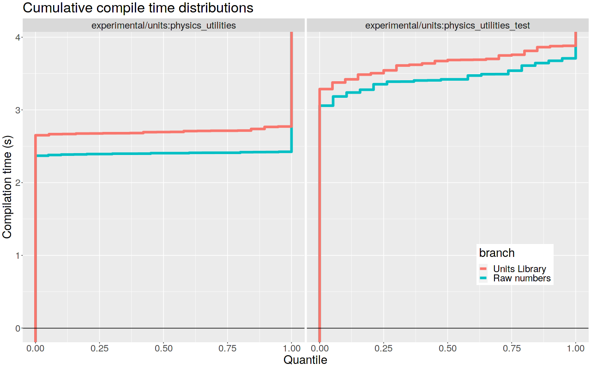
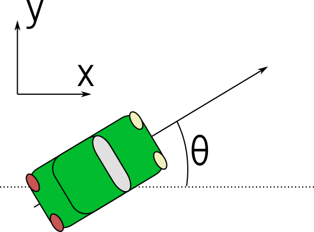

<section data-background="./hogg_cppcon21.png" data-background-size="contain">

---

# What will we learn?

Notes:

Let's start with what _you_ should expect to learn from this talk.

---

## Some questions we'll answer

- What _is_ a units library?
- What are the main benefits, _in practice_?
- What should I look for in a units library?
- Migration: how do you get "there" from "here"?
- How should we integrate with linear algebra libraries?
- How should we handle serialization and other languages?

Notes:

We'll get on the same page about _what_ a units library is, and what you
_really_ gain from it.  We'll talk about traps and pitfalls, and interfaces
that protect against them.  We'll share practical strategies for how to go from
"no units" to "units": there's good news here!  Finally, we'll get into the
nitty gritty for some specific design questions you're likely to encounter,
when interfacing with linear algebra libraries and other languages.

---

## Aurora's units library


Notes:

So, who am I?  My name's Chip, and I work at Aurora innovation.  Our mission is
to bring the benefits of self-driving, safely, quickly, and broadly.  Among
other things, I'm the lead designer and maintainer of _our_ units library. This
is actually the second units library I've helped build in the autonomous
vehicle space; I was also the lead designer for the one at Uber's Advanced
Technologies Group.

I'm going to use our units library as a case study to illustrate the ideas in
this talk.  Why not use an open-source library?  A couple of reasons.

- First, this talk is about units libraries generally, not one specific
  library.  You should be able to apply the _concepts_ you learn to _whatever_
  library you use.
- Second, _this_ library is the second generation which was _designed_ around
  the principles and insights we'll go over in the talk, and thus it
  illustrates them the most naturally.

Some of you may know there's a new units library, mp-units, which is making a
concerted push to become the _standard units library_.  We support this effort,
and we both hope and expect that it will succeed, fingers crossed for C++26.
We are actively engaged with the authors to do whatever we can to help
`std::units` become the best library it can be.

---

# What is a units library?

Notes:

So: what are we talking about?

---

## Remember functions like this?

<!-- .element: data-auto-animate -->

Utility function:
```cpp []
void sleep(int duration_ms);
```

<div class="fragment">

Example callsite:
```cpp []
sleep(1000);
```

</div>

Notes:

Let's start with an example of the _kind_ of code we used to see _all the
time_.  We've got a sleep function which takes a duration, and it helpfully
labels the units for that duration as milliseconds.

(click)
But when we read a callsite in a random part of the codebase, it just says
"sleep one thousand".  One thousand _what_?  This kind of interface is a bug
waiting to happen... and it typically doesn't wait very patiently.

---

## `std::chrono` to the rescue!

<!-- .element: data-auto-animate -->

Utility function:
```cpp
void sleep(std::chrono::milliseconds duration);
```

<div class="r-stack">
<div class="fragment">

Example callsite(s):
```cpp [1]
sleep(1000ms);


```

</div><div class="fragment">

Example callsite(s):
```cpp [2]
sleep(1000ms);
sleep(1s);


```

</div><div class="fragment">

Example callsite(s):
```cpp [3]
sleep(1000ms);
sleep(1s);
sleep(1'000'000us); // Error: won't compile
```

</div>
</div>

Notes:

Here's what we would do _now_.  We'd use `std::chrono` types in our interfaces.
Why?

(click) Well, for one thing, the callsites are now perfectly clear: we can see the
units directly.

(click) For another, they're more _flexible_: we can pass something like `1s`,
and we'll automatically get a correct conversion!

(click) Finally, they're _safe_: if we pass something like `1'000'000us`, it
_won't compile_, because microseconds to milliseconds is a lossy conversion.

A decade ago, the chrono library taught us that we _can_ have nice things, and
now we all refuse to settle for anything less.

**Unless...** we're dealing with _any_ dimension other than time.

Well!  We all know the pain points of time units.  Do we ever _really_ see
problems from any more obscure dimension, like, say, _impulse_?

---

## Mars Climate Orbiter: \$193MM disaster


<figcaption>

By Xession - Own work, CC BY 3.0, https://commons.wikimedia.org/w/index.php?curid=12688947

</figcaption>

Notes:

This is by now a familiar tale to many, but on September 23, 1999, the Mars
Climate Orbiter lost communication with Earth.  NASA software _received_
impulse values, which it interpreted in units of Newton-seconds.  Lockheed
software _produced_ impulse values in units of pound-force-seconds, which are
off by a factor of about 4 and a half.

Now---_a lot of things_ had to go wrong to lose the spacecraft, including
significant organizational issues.  But it's still true that _if_ they had had
a units library, and used it correctly, _then_ the error that brought down the
spacecraft could not have occurred.

---

## Evaluating "the pitch"

> "You should use units libraries because<br>
> they eliminate this **entire category** of error."

<ul>
<li class="fragment">Do units libraries <em>really achieve this?</em>  <span class="fragment"><b>Yes.</b></span></li>
<li class="fragment">Is this the main reason to use them?  <span class="fragment"><b>No.</b></span></li>
</ul>

Notes:

So: is that why we should use units libraries?  To prevent unit errors?  The
truth is more subtle.

(click)

First: **do** they prevent these errors?
(click)
Yes.  They do.

(click)
But is this the main benefit they bring?

(click)
No.

---

## Tracking units without a library

<!-- .element: data-auto-animate -->

- Unit suffixes on **every** identifier
- Stick to a single system of units

<pre data-id="tracking"><code class="C++" data-line-numbers="|2-3,7-8,11-12|11|" data-trim>
struct DynamicLimits {
    double jerk_limit_mpsss;
    double accel_limit_mpss;
};

double distance_to_stop_m(
    double current_speed_mps,
    double current_accel_mpss,
    const DynamicLimits &limits);

double speed_limit_mps = 65 * MPH_TO_MPS;
double stopping_distance_m = distance_to_stop_m(
    speed_limit_mps, 0., DynamicLimits{-10., -5.});
</code></pre>

Notes:

It turns out that in practice, unit errors are _extremely_ rare, at least
everywhere I've worked.  "Change all your numeric types to solve a problem that
almost never happens" is just not a compelling sales pitch.

Why are they rare?  Because developers do significant manual work to maintain
unit correctness.  Here are some rules people typically follow to achieve this.

- (click) Every identifier which holds a _quantity_ **must** end in a suffix
  which indicates the units.
- (click) Stick to a single system of units, usually SI, everywhere: if your
  quantity is in some other units, convert it right away.

(click) This is fine.  Assuming you have a strong culture of code review, a
culture of unit tests, integration tests, and end-to-end tests, this _is_
effective at preventing unit errors.  It's just that, wow, is it a _lot_ of
manual work.

---

## The Bits are Alright

<div class="r-stack r-stretch" style='zoom: 0.8; margin: auto;'>


</div>

Notes:

And yet, if you think about it... there's nothing wrong with this _binary
executable_.  The numeric types that flow through the program---`double`,
`float`, `int`, etc.---are _exactly the same types_ we _want_ flowing through
it.

This is the key point of what we want from a units library.

Different **source code**,

(click)
which produces the **same program** when we get it right,

(click)
but **does not build** when we get it wrong.

Now, the _usual_ case is that the code is _correct_: we passed the right values
to the right places, got the right bits flowing through the system.  So what
value is the units library providing in this usual case, where we end up with
the same program we would have had anyway?

---

## The _Benefit_ is the _Interfaces_

Notes:

It's not the _machine_ side; it's the _human_ side.  Interfaces should be
_easy_ to use _correctly_, and _hard_ to use _incorrectly_: it's the
fundamental rule of software engineering!  It's what keeps the software easy to
change, without _fear_.

A units library shouldn't feel like a nitpicking nanny who whacks you with
compiler errors if you don't behave.  Rather, it should feel _liberating_ and
_accelerating_, like having a trusted assistant who understands what you mean,
and always gets the small stuff right.

With a good units library, you move faster!  You can build more expressive,
_next-level_ interfaces, avoid mixing up parameters, have concise yet readable
callsites, reduce your cognitive load by reasoning _more locally_ about your
code, ...

And, yes, it does eliminate an _entire category_ of error with no runtime
penalty, too.

---

# Building the C++ Interfaces

Notes:

Now let's see how we might build an actual library.  We'll start with a crash
course in Quantity Calculus, to get us all on the same page about _what_ we're
actually building.  Then we'll build up our C++ library in _conceptual layers_,
so we can see how units, quantities, and dimensions all fit together.

---

## Units: How do they work?

_A crash course in Quantity Calculus_

<div class="r-stack">


</div>

Notes:

A _Quantity_ is something that is measured,

(click)
like the _distance_ between two points; or, the _temperature change_ in a pot
of water.  To actually _perform_ this measurement, you need a _Unit_, which is
just some other quantity we can use as a reference.

(click)
So, here's another distance, which we've singled out and called the "foot".

(click)
We can see that two of these end-to-end gives the _same distance_ as our first
one, so this quantity equals 2 feet.  2 is _value_, and _feet_ is the unit.

(click)
Of course, we could use another unit, say, the inch.

(click)
If we measured the same length using this unit, we'd find a value of 24.

Importantly, this is the _same quantity_.  That is, if _a_ is 24 inches, and
_b_ is 2 feet, then a **equals** b; it doesn't equal, say, 12 b.

A _Dimension_ is basically a collection of quantities that can be meaningfully
_compared_: an equivalence class, if you will.  You can compare a meter to a
yard---turns out, a meter is bigger---so they have the same _Dimension_.  But
it makes no sense to ask if a meter is bigger than a kilogram; they have
_different_ Dimensions.

---

## Math with Quantities

_Treat **unit symbols** like **algebraic variables**_

<div class="fragment">

<u>Same dimension</u><br>

<div class="r-stack" style='margin-top: -1em; margin-bottom: -1em;'>
<div>

`$$
\begin{align}
2[x] + 3[12x] &\color{white}{=} \color{white}{2[x] + 36[x]} \\
&\color{white}{=} \color{white}{38 [x]}
\end{align}
$$`

</div><div class="fragment fade-in-then-out">

`$$
\begin{align}
2[x] + 3[12x] &= 2[x] + 36[x] \\
&\color{white}{=} \color{white}{38 [x]}
\end{align}
$$`

</div><div class="fragment fade-in">

`$$
\begin{align}
2[x] + 3[12x] &= 2[x] + 36[x] \\
&= 38 [x]
\end{align}
$$`

</div>
</div>

<div class="fragment">
<u>Mixing dimensions</u><br>

<div>

`$2[x] + 3[y] \rightarrow \text{ERROR}$`

</div><div class="r-stack">
<div class="fragment">

`$2[x] + (3[y] \cdot 4[x/y]) \color{white}{= 2[x] + 12[x] = 14[x]}$`

</div><div class="fragment">

`$2[x] + (3[y] \cdot 4[x/y]) = 2[x] + 12[x] \color{white}{= 14[x]}$`

</div><div class="fragment">

`$2[x] + (3[y] \cdot 4[x/y]) = 2[x] + 12[x] = 14[x]$`

</div></div>
</div>

<div class="fragment">

$5[x^2] \cdot (8[y])^{1/3} = 10[x^2 y^{1/3}]$
</div>
</div>


Notes:

Quantity calculus is deep... but, this is a crash course in a software talk!
So, follow this simple rule: treat _unit symbols_ like _algebraic variables_.

(click)
Suppose we have two units of the same dimension.  One is "x", and one
is equivalent to "12 x"---maybe they're inches, and feet?  (The square brackets
here indicate the unit.)  We first _choose_ a common unit of that dimension.

(click)
Say we choose "x".  Then after converting everything to "x-units",

(click)
we can just add the values.

(click)
Now take another unit, "y", which has a _different dimension_ than "x".  In
this case, trying to add these quantities is meaningless.

(click)
But remember, we can do algebra with quantities.  So multiplying by an "x-per-y" unit,

(click)
you bring everything into "x-units",

(click)
and you can then simply add.

(click)
Finally, you can always take products and rational powers of units.

If we look at this slide, we can see what we need from our unit representation.

- We can _change the magnitude_ of a unit.
- We must _distinguish incompatible dimensions_.
- We must _support products and rational powers_ of units---and, we have to
  know that a y, times an x-per-y, gives us an x which we can add to any other
  x!

---

## Representing Units



Strategy: compose from _dimension_ and _magnitude_

Notes:

Here's our strategy.  We'll build our Unit from two _key parts_.  The
_dimension_ will be what distinguishes different _kinds_ of quantities.  The
_magnitude_, which is a positive real number, gives us the _relative size_ of
units of that dimension.

So, inches and feet will both have a _dimension_ of "length".  And whatever the
_magnitude_ of an _inch_ is, we know the _magnitude_ of a _foot_ is _12 times
bigger_.

If we want _computable relationships_ between units, so we can know that a
speed times a time is a length, we're going to need to do some template
metaprogramming.  But don't fret---we place the utmost importance on our end
user experience !  If we're doing this right, _none_ of the template
metaprogramming leaks to the end users.  They _will_ use templates... but
nothing they see will be any scarier than the `int` in `std::vector<int>`.

That said, let's see how to make Dimensions.

---

## Level 0: Types for _Dimensions_

```cpp [1-5|7,8|10-17|7,8,12,16|7,8,12,16,21|7,8,13,16|7,8,13,16,22|7,8,14,17|19-23|10-23]
template <typename... BaseDimPowers>
struct Dimension;

template <typename Base, int Num, int Denom=1>
struct Pow;

// Ordered base dimensions (example):
// Length, Mass, Time, Angle

using result_dim = product_t<
    Dimension<
        Pow<Length, 1>,
        Pow<Time, -3>,
        Pow<Angle, 1>>,
    Dimension<
        Pow<Time, 2>,
        Pow<Angle, -1>>>;

using result_dim =
    Dimension<
        Pow<Length, 1>,
        Pow<Time, -1>
        >;
```

Notes:

The common approach is to use a type list of _powers_ of _base dimensions_:
length, mass, time, etc.  We can represent _other_ dimensions as products and
powers of these _base_ dimensions; for example, acceleration is length per time
squared.

(click)
We're going to look at the product operation.  To carry it out, we just merge
the typelists.  But to ensure our representation stays _unique_, we need _a
well-defined ordering_ of the base dimensions; in this example, we choose the
ordering Length, Mass, Time, then Angle.

(click)
Now we'll briefly step through this multiplication to see how the merging works.

(click)
At the head of our lists, we have a length and a time.  These are different.
Well, length comes first in our ordering,

(click)
so we copy it directly to the output.

(click)
Now we have time and time.  These are the _same_, so we _add the exponents_

(click)
and copy the result to our output.

(click)
Finally, angle and angle: again the same, but when we add the exponents, we get
0, so we _omit_ Angle from the output to keep our types unique.

(click)
In the end, we find that the product is length-to-the-1, time-to-the-minus-1.

So, this is the products operation.  I'm skipping over the "power" operation,
but we do provide that too.  And once we have those, we automatically get
_inverse_, and _quotient_, and _root_, too!

---

## Level 0: Types for _Magntitudes_


<div class="fragment">

Magnitude rep: **same as Dimension!**

</div>

Notes:

That was Dimension.  We also need a representation for the other half of our
Unit, which is Magnitude.

(click)
Surprisingly, we use the _same representation_!  Just instead of basis
_dimensions_ like _length_, we have basis _numbers_.  It _kills_ me to not have
time to talk about this, but if you're curious about how to represent positive
real numbers by a vector space over the rationals, let's chat later.

Last thing to note in passing is that Magnitude, too, has product and pow, and
therefore also inverse, quotient, and root.

---


## Level 0: Types for _Units_

```cpp [1-2|4-6]
template <typename Dim, typename Mag>
struct Unit;

template <typename... Units>
using product_t = Unit<dim::product_t<dim_t<Units>...>,
                       mag::product_t<mag_t<Units>...>>;
```

Notes:

And now we can build our unit.  All of the hard work is done!  We _delegated_
it to the Dimension and Magnitude.

(click)
So, to compute the _product_ of a bunch of units, you take the _product_ of
their dimensions, and the _product_ of their magnitudes.  Same thing for the
other operations.

---

## Level 0: Example units

<div class="r-stack">
<div>

```cpp [1-3]
// Base dimension; "default" magnitude.
using Meters  = Unit<Dimension<Pow<Length, 1>>>;
using Radians = Unit<Dimension<Pow<Angle, 1>>>;


```

</div><div class="fragment">

```cpp [5-7]
// Base dimension; "default" magnitude.
using Meters  = Unit<Dimension<Pow<Length, 1>>>;
using Radians = Unit<Dimension<Pow<Angle, 1>>>;

// SI prefix scaling
template <typename U>
using centi = scale_unit<U, mag::ratio_t<1, 100>>;


```

</div><div class="fragment">

```cpp [9,10]
// Base dimension; "default" magnitude.
using Meters  = Unit<Dimension<Pow<Length, 1>>>;
using Radians = Unit<Dimension<Pow<Angle, 1>>>;

// SI prefix scaling
template <typename U>
using centi = scale_unit<U, mag::ratio_t<1, 100>>;

// Other scaled units
using Inches = scale_unit<centi<Meters>, mag::ratio_t<254, 100>>;


```

</div><div class="fragment">

```cpp [12,13|]
// Base dimension; "default" magnitude.
using Meters  = Unit<Dimension<Pow<Length, 1>>>;
using Radians = Unit<Dimension<Pow<Angle, 1>>>;

// SI prefix scaling
template <typename U>
using centi = scale_unit<U, mag::ratio_t<1, 100>>;

// Other scaled units
using Inches = scale_unit<centi<Meters>, mag::ratio_t<254, 100>>;

// Prefer building out of other units, NOT raw `Unit<...>`
using MilesPerHour = quotient_t<Miles, Hours>;
```

</div>
</div>

Notes:

Having built our unit _machinery_, we're ready to define some actual _units_.
We'll start by choosing one unit for each base dimension; it really couldn't
matter less which one we pick.

(click)
We can also define templates for all of the SI prefixes to make it _really
easy_ to build new units.  So, a centi-U is a U, scaled by a factor of 1/100.

(click)
We can make even more scaled units; for example, an Inch is 2.54 centimeters.
This gives us a path to get things like Miles from Inches, and Hours from
Seconds.

(click)
And finally, we can build up compound units by taking products of powers of
existing units.  That's cleaner than using raw Dimensions and Magnitudes; it
speaks the truth more directly.  Really, we should only be _directly_ defining
one unit per base dimension.

(click)
I want to emphasize that these "unit types" have nothing to do with values, or
numeric representations!  The product of Newtons and Meters is Joules,
_regardless of whether we're using `int`, `double`, whatever_.  To store
values, we need to go the next level up, to Quantity.

---

## From `duration` to `Quantity`

<div class="fragment">
<span style='color: red;'><code>duration</code></span><code>&lt;</code><span style='color: green;'><code>Rep</code></span><code>, </code><span style='color: blue;'><code>Period</code></span><code>&gt;</code>
</div>
<div class="fragment">

...becomes...

<code>Quantity&lt;</code><span style='color: red;'><code>DurationUnit</code></span><code>&lt;</code><span style='color: blue;'><code>Period</code></span><code>&gt;, </code><span style='color: green;'><code>Rep</code></span><code>&gt;</code>

</div>
<div class="fragment">

...which generalizes to...

<code>Quantity&lt;</code><span style='color: blue;'><code>Unit</code></span><code>, </code><span style='color: green;'><code>Rep</code></span><code>&gt;</code>

</div>

Notes:

We already have a very familiar example of a kind of Quantity type.  It's
`std::chrono::duration`.  Here's the correspondence.

(click)
A _duration_ is templated on a _Rep_, which is the _underlying numeric type_,
and a _Period_, which indicates the duration unit.

(click)
So what this would look like as a Quantity is: Quantity of the "duration unit"
with this period, and rep.  What we're doing here is making it _explicit_ that
our unit of measure has dimension _time_.

(click)
And now it becomes clear: with a Quantity, we could put _any_ unit here.

---

## Level 1: Getting values in and out

```cpp
Quantity<Meters, double> length;
```

<div class="container fragment">
<div>

Putting values in:

<div class="r-stack">
<div>

```cpp[1]
length = make_quantity<Meters>(4.3);


```

</div><div class="fragment">

```cpp[2]
length = make_quantity<Meters>(4.3);
length = meters(4.3);


```

</div><div class="fragment">

```cpp[3|]
length = make_quantity<Meters>(4.3);
length = meters(4.3);
length = 4.3_m;
```

</div>
</div>
</div>
<div class="fragment">

Getting values out:

<div class="r-stack">
<div>

```cpp[]
// Quantity<Meters, double> length;
length.in<Meters>();
```

</div>
</div>
</div>
</div>

Notes:

Now let's see how to get values in and out, across the library boundary.  We'll
use a Quantity of Meters with a double Rep for all these examples.

(click)
Remember that we want the same _data_ flowing through our binary as before:
`double`, `float`, `int`, etc.  So we have the **make quantity** helper.  You
name the unit, and it _deduces_ the Rep based on what you pass it.  This makes
the unit _feel like a "tag", a semantic annotation_.

This is powerful and flexible, but also a _little_ verbose.  We _don't_ want to
over-burden our users!

(click)
So we also provide named functions for our common units, such as `meters()`.
Just like make_quantity, it wraps whatever type you pass it.

There's a third way to create a Quantity if you have a literal.

(click)
No surprise here, it's a _user-defined literal_, although it only works with
`int` and `double`.

(click)
Now notice what all three of these have in common: you have to _specify the
unit, at the callsite_.  What's _missing_ from this is: we don't provide a
public constructor for Quantity.  That's intentional.  We'll explain that more
when we get to the concept of Unit Safety. <!-- TODO: fulfill promise -->

As for getting values out, you use the `.in` helper, with your unit.

(click)
So for a variable length, you'd say, `length.in<Meters>()`.  This gives you
the... _length, in meters_.

Note that the unit name is like a kind of password that you set when storing
the value.  To retrieve the _same value_, you must speak the _same password_.
We see that _every method listed here_ visibly indicates the unit, meters, _in
some way_, and you can't cross the library boundary in either direction without
_naming the unit at the callsite_.  We'll talk more about this when we come to
**unit safety**, but for now note the _callsite readability_ it provides.

---

## Level 1 (cont'd): Operations

<div class="r-stack">
<div>

```cpp[1]
Quantity<Meters> a = 1_m + 2_m;            // OK: 3_m


```

</div><div class="fragment">

```cpp[3]
Quantity<Meters> a = 1_m + 2_m;            // OK: 3_m

Quantity<Meters> b = 1_m + (2_mps * 3_s);  // OK: 1_m + 6_m = 7_m


```

</div><div class="fragment">

```cpp[5]
Quantity<Meters> a = 1_m + 2_m;            // OK: 3_m

Quantity<Meters> b = 1_m + (2_mps * 3_s);  // OK: 1_m + 6_m = 7_m

Quantity<Meters> c = 1_m + 1_s;            // NOT OK: compiler error


```

</div><div class="fragment">

```cpp[7]
Quantity<Meters> a = 1_m + 2_m;            // OK: 3_m

Quantity<Meters> b = 1_m + (2_mps * 3_s);  // OK: 1_m + 6_m = 7_m

Quantity<Meters> c = 1_m + 1_s;            // NOT OK: compiler error

Quantity<Meters> d = 1_m + 1_ft;           // ???
```

</div>
</div>

Notes:

Of course, just putting values in and getting them out is not very exciting.
What can you _do_ with these Quantities?

We already know it's _always valid_ to multiply and divide them, and raise them
to rational powers.  Let's consider an operation that's _not_ always valid:
say, addition.

We can add 2 quantities of the same unit: no problem.

(click)
That's true even if we had to _do some reasoning_ to get the unit.  So,
2 _meters per second_, times 3 _seconds_, gives us 6 _meters_, which we can
then add to the _other_ quantity of meters.  Cool!

(click)
What we definitely _can't_ do is add incompatible quantities.  1 meter plus 1
second is just intrinsically nonsense.  This is always a build error.

(click)
And then there's something like this.  1 meter plus 1 foot.  Is this
meaningful?  Should the library accept this?

Thinking in quantities: this totally makes sense!  This is a _well-defined
quantity of length_.

But thinking _in code_, we can't carry out addition until we _first_ get the
inputs into a common unit.  So what should we do?  This question takes us to the _next level_ of a units library: _unit conversions_.

---

## Level 2: Conversions


<div class="r-stack" style="zoom: 0.8;">
<div class="fragment fade-in-then-out" data-fragment-index="1">

`$$
\begin{align}
d &= 60\, \left[\frac{\text{mi}}{\text{hr}} \right] \cdot 10\, [\text{s}] \\
&= 600\, \left[ \frac{\text{mi} \cdot \text{s}}{\text{hr}} \right] \\
&\color{white}{=} \color{white}{600 \left[ \frac{1}{3600} \text{mi} \right]}
\color{white}{= 600 \left( \frac{1397}{3125} \right) [ \text{m} ]} \\
\end{align}
$$`

</div><div class="fragment fade-in" data-fragment-index="2">
<span class="fragment fade-out" data-fragment-index="4">

`$$
\begin{align}
d &= 60\, \left[\frac{\text{mi}}{\text{hr}} \right] \cdot 10\, [\text{s}] \\
&= 600\, \left[ \frac{\text{mi} \cdot \text{s}}{\text{hr}} \right] \\
&= 600 \left[ \frac{1}{3600} \text{mi} \right]
\color{white}{= 600 \left( \frac{1397}{3125} \right) [ \text{m} ]} \\
\end{align}
$$`

</span>
</div><div class="fragment fade-in" data-fragment-index="4">

`$$
\begin{align}
d &= 60\, \left[\frac{\text{mi}}{\text{hr}} \right] \cdot 10\, [\text{s}] \\
&= 600\, \left[ \frac{\text{mi} \cdot \text{s}}{\text{hr}} \right] \\
&= 600 \left[ \frac{1}{3600} \text{mi} \right]
= 600 \left( \frac{1397}{3125} \right) [ \text{m} ] \\
\end{align}
$$`

</div>
</div>

<div class="container">
<div class="fragment" data-fragment-index="3">

**Explicit-only:**

```cpp
QuantityD<Meters> d =
    (60_MPH * 10_s).as<Meters>();
```

</div><div class="fragment" data-fragment-index="4">

**Implicit allowed:**

```cpp
QuantityD<Meters> d = 60_MPH * 10_s;
```

</div>
</div>

Notes:

Take this practical example.  If you drive at 60 miles per hour, for 10
seconds, how far do you go?

(click)
Well, the value is 600, 60 times 10.  The _unit_ is "Mile-seconds per hour",
which _sounds_ weird,

(click)
but it's just one thirty-six hundredth of a mile.

OK; _now_ try assigning it to a Quantity of Meters.

(click)
Some libraries look at this and say: whoah, the _units_ don't match up.  If you
want a conversion, you've got to _ask_ for it, maybe with some kind of
_quantity cast_, which we spell "dot-as".  Everything is _explicit_.  Boost
units takes this approach.

(click)
Other libraries say: look, we _know_ the exact conversion factor between this
_weird_ unit, and the target unit, Meters.  We know it at compile time.  Let's
just multiply by that ratio!  mp-units takes this approach, as do we.  We'll
look more later at some of the tradeoffs involved in this choice.

<!-- mp-units scratchpad: https://godbolt.org/z/91dGqKzEc -->

---

## Top Level: End user interface

`units/units.hh`
```cpp
#include "units/math.hh"
#include "units/quantity.hh"

using DisplacementD = Quantity<Meters, double>;
using DisplacementF = Quantity<Meters, float>;

using VelocityD = Quantity<MetersPerSecond, double>;
using VelocityF = Quantity<MetersPerSecond, float>;

// ...
```

Notes:

There's room for a kind of "top level" here: how will _your project_ interface
with the units library?  This is conceptually distinct from the "library
proper", and it can have a big impact on that last 5% of user experience.

Suppose your project starts from the typical manual approach, where you have
a _preferred unit_ for each dimension.  Then you can create these
_dimension-named aliases_.  These are nice because most end users don't really
care about the _unit_, nor should they!  What they should care about is the
_kind of thing_ they are passing: the _length_ of the car, the _speed_ limit.
So dimension-named aliases can promote flow when reading code.  What's more,
using each dimension's "default unit" in _most_ cases _reduces the number of
conversions_, which is nice.  Remember, the times people _do_ really care about
the unit, they can still use `Quantity`!

Another consideration for the end user experience?  _Be fanatical_ about
_minimizing_ the number of headers, ideally getting it down to 1.  So for
example: you include units?  You get all your math and utility functions, sin,
arctan, round, for free.  Asking people to change their _fundamental numerical
types_ is _already_ an uphill battle. Don't make it even harder by making them
guess which header they forgot when their code doesn't build!

---

## Library structure: summary

<div class="r-stack">






</div>

Notes:

So let's look at the _big picture_ summary of the library's structure and
interfaces.  The **foundation** is **units**, and the ability to _reason_ about
units.  Products, powers, prefixes, and a whole bunch of common units provided
out of the box.  Again, this is _independent_ of values; for that, we need:

(click)
Level 1: Quantities.  The ability to _tag arbitrary numeric values_ with a
_Unit_.  We can multiply or divide Quantities; and for same-type Quantities, we
can add, compare, and assign them.

(click)
As for _making_ a Quantity, we have a few ways.  `make_quantity<Meters>` is
verbose but flexible, `meters()` is more succinct, and "underscore-m" is great
when you have a literal.  Note that you _cannot enter the library without
naming your unit at the callsite_.

(click)
To get values out, you speak the same password you set on entry: "dot-in,
meters".  Again: you must name the unit at the callsite.  In fact... this API
is awfully suggestive.

(click)
As we move to Level 2, _Conversions_, you might have guessed the interface:

(click)
You can pass _any_ unit to `.in`, and it will perform the conversion if it
exists.  We can see that this exits the library.  If you want to do the
conversion, but _keep_ it as a `Quantity`:

(click)
You call `.as()`.  `.as()` has the same syntax as `.in()`.  `.as()` is for
"quantity casting", `.in()` is for value extraction.  These APIs lead to nice,
readable, concise callsites.

(click)
We saw there's also this optional part to layer 2: _implicit_ conversions.
This reduces friction for mixed-unit comparison, addition, etc., though there
_are_ some tradeoffs here, and not every library permits this.

(click)
Finally, there's this optional top-level layer you can put on the library to
tailor it for your project.

_Lots of design choices here._  What **principles** should guide our decisions?

---

# Principles

Notes:

We'll look at the ones that have guided the Aurora library.  The point is
_not_: "everyone should do things exactly how we've done them!"  Rather, it's:
"these have worked well for us, and they should be _discussion points_ for
every other library.

Like: it's OK to make a different decision for most of these, but what we want
to prevent is people _not consciously making_ a decision (because they didn't
know what to consider).

---

## Principle: Batteries included

Every time someone _takes a value out_, it provides _signal_.

> "What could we be doing better?"

<div class="r-stack">
<div class="fragment fade-in">

```cpp[]
constexpr auto angle = 45_deg;

std::cout << angle.in<Degrees>() << " deg";


```

</div><div class="fragment fade-in">

```cpp[]
constexpr auto angle = 45_deg;

std::cout << angle.in<Degrees>() << " deg";


std::sin(angle.in<Radians>());


```

</div><div class="fragment fade-in">

```cpp[]
constexpr auto angle = 45_deg;

std::cout << angle.in<Degrees>() << " deg";


std::sin(angle.in<Radians>());


auto normalized = make_quantity<Degrees>(angle.in<Degrees>() % 360);


```

</div><div class="fragment fade-in">

```cpp[1,4-11]
constexpr auto angle = 45_deg;

std::cout << angle.in<Degrees>() << " deg";
std::cout << angle;  // "45 deg"

std::sin(angle.in<Radians>());


auto normalized = make_quantity<Degrees>(angle.in<Degrees>() % 360);


```

</div><div class="fragment fade-in">

```cpp[1,4,7-11]
constexpr auto angle = 45_deg;

std::cout << angle.in<Degrees>() << " deg";
std::cout << angle;  // "45 deg"

std::sin(angle.in<Radians>());
sin(angle);

auto normalized = make_quantity<Degrees>(angle.in<Degrees>() % 360);


```

</div><div class="fragment fade-in">

```cpp[1,4,7,10]
constexpr auto angle = 45_deg;

std::cout << angle.in<Degrees>() << " deg";
std::cout << angle;  // "45 deg"

std::sin(angle.in<Radians>());
sin(angle);

auto normalized = make_quantity<Degrees>(angle.in<Degrees>() % 360);
auto normalized = angle % 360_deg;


```

</div><div class="fragment fade-in">

```cpp[1,4,7,11]
constexpr auto angle = 45_deg;

std::cout << angle.in<Degrees>() << " deg";
std::cout << angle;  // "45 deg"

std::sin(angle.in<Radians>());
sin(angle);

auto normalized = make_quantity<Degrees>(angle.in<Degrees>() % 360);
auto normalized = angle % 360_deg;
auto normalized = angle % 1_rev;
```

</div>
</div>

Notes:

First: Batteries Included.  We _really want_ our Quantity types to be _at
least_ as capable as the raw numeric types they wrap, and ideally more capable!
So if someone _takes the raw value out_, we see that as a clue: it means we
didn't meet their needs. And we ask: can we fix that?

(click)
Here are some examples.

- Streaming the _value of the angle_, in degrees, and then _manually_ streaming
  "deg".
- (click) Taking the sine of the _value of the angle_, in radians.
- (click) Getting the value _out_ in degrees, normalizing to 360, and then putting it
  back in!

In every case, these are things the library should support.  In fact, with
native support, these things end up _better_ than the raw numeric types!

(click)
You get your units printed for free.

(click)
You can _actually write_ "sine of 45 degrees".

(click)
You can take the mod via 360 degrees.  Or better yet?

(click)
Take the mod via "one revolution".  That's the idea you're really trying to
express anyway!

Units libraries are about _better user experiences_, not _burdening users_.

---

## Principle: Wrapped types<br><em>mimic unwrapped types</em>

<div class="r-stack">
<div>

```cpp[1]
3.25f * 5;                         //       16.25f


```

</div><div class="fragment fade-in">

```cpp[2]
3.25f * 5;                         //       16.25f
3.25f * hours(5);                  // hours(16.25f)


```

</div><div class="fragment fade-in">

```cpp[3|]
3.25f * 5;                         //       16.25f
3.25f * hours(5);                  // hours(16.25f)
miles_per_hour(3.25f) * hours(5);  // miles(16.25f)
```

</div>
</div>

Notes:

Next: Wrapped types mimic unwrapped types.

We want people to be able to leverage their well honed C++ intuition.  It must
be _easy_ to mix and match types for the Rep!

We know a float times an int is a float, for example.

(click)
Well, a float times a _wrapped_ int should be a _wrapped_ float, with that same
unit.

(click)
And if both inputs are wrapped, the result has _the same rep and value as
before_, wrapped with the _unit_ that results from the computation.

(click)
The units should sit on top at build time, and get out of the way at runtime.

By the way: a corollary is that we _don't_ want a system-wide setting for a
"default Rep" for the library. It needs to be _easy_ to use doubles here,
floats there, ints, whatever.

Why can't everyone just use `double`?  Here's an example.  Our embedded team
shares our common libraries, but they run on a platform where `float` gets
_hardware acceleration_, but `double` is stuck with _software emulation_. The
previous units library at Aurora had one global config for the rep.  We weren't
about to use `float` in the autonomy stack!  So the embedded team used `double`
and ate the performance hit.  Problem: our units library didn't _just_ change
the source code; it changed the _types flowing through the binary_.  When we
switched to our in-house library, we restored the ability to use the best types
for each component.

---

## Principle: Quick to Compile



Notes:

Quick to compile!

Every units library increases compile time, because you are doing additional
work you weren't doing before to produce the same binary executable.  It is
_critical_ to minimize this burden---and that means you must _measure_ it!

We keep scripts handy so we can measure compile time changes at the drop of a
hat.  This plot shows some Quantity-heavy files, with and without the units.
We can see that the cost is _measurable_, but _not subjectively noticeable_.  I
think that's a good way to frame it, because "subjectively noticeable" is about
where you start losing users.  There's another units library we tried where
just when you pound-include it, you can _feel_ the difference: multiple seconds
per target.  I saw different teams across multiple companies decide _not_ to
use that units library _for that reason_. So, compile time performance matters
_a lot_ when it becomes bad enough to notice.

---

## Principle: Unit safety

**"Unit safety"** means:
- We can verify that _units are handled correctly,_<br>
  for each _individual_ line of code, by _inspection_.

Notes:

Finally, let's talk about _unit safety_.  This principle is all about
readability: _increasing confidence_, and _reducing cognitive load_.

How can you judge whether a line of code has handled units correctly?  For
Quantity types, we know the units library takes care of this!  So we look at
the _boundaries_: the places where _values_ enter and exit the library.

_Cognitive load_ depends on how far you have to look to make sure those values
have the right units.  The best possible case is that you don't have to leave
this line of code.

---

## Example: unknown units

<div class="container">
<div class="fragment" style="background-color: #ffdddd">


`rect.proto`:
```proto []
message Rectangle {
    // The length, in meters.
    double length = 1;

    // The width, in meters.
    double width  = 2;
}
```

<div class="fragment">

`client.cc`:
```cpp [2]
proto::Rectangle rect;
auto length = meters(rect.length());
```

</div>
</div><div class="fragment" style='background-color: #ddffdd'>

`rect.proto`:
```proto [|3,6]
message Rectangle {
    // The length, in meters.
    double length_m = 1;

    // The width, in meters.
    double width_m  = 2;
}
```

`client.cc`:
```cpp [2]
proto::Rectangle rect;
auto length = meters(rect.length_m());
```

</div>
</div>

Notes:

To see what we mean by this, we'll start with an example of code that is
_correct_, but is **not** unit safe.

(click)
We've got some protobuf message definition.  Now if you're not familiar with
protobuf, that's fine; just ignore the `=1` and `=2`, and think of this as a
_serializable struct_ with two members, `length` and `width`.

(click)
So this line here _does not have_ unit safety.  Yes, the units of
`rect.length()` are indeed meters... but to know that, you have to look up some
other file and go read a comment.  Not so good.

In fact, _no feature of any possible units library_ could make _this_ line
unit-safe.

(click) The root of the problem was the name of the protobuf field.  Using only
a comment for the units has poor _callsite readability_.  We know how to handle
this correctly: add the unit suffix.  Now the code _is_ unit-safe, because we
have a proper handoff of the units-tracking: from the suffix on the raw number,
to the name of the function that makes the quantity. We call **meters**, and we
pass it a length in **meters**.

Could there still be a units error?  Yeah!  We could have initialized the field
with a length value measured in some other unit!  But if there _is_ an error,
it's in _some other_ line, and we can see it _in that line_.  **This** line is
correct by _inspection_; we can read it, and _move on_.

---

# Pitfalls

Notes:

So, we want our interfaces to be as smooth and user-friendly as possible.  But
what we _don't_ want is for _wrong_ code to _look right_.  Let's talk about
some of the ways that can happen, and the strategies we use to guard against
that.

---

## Pitfall: Hidden overflow

```cpp
bool is_first_bigger = (11_m > 12_yd);
```

<div class="r-stack">
<div class="fragment fade-in-then-out">

`$$
\begin{align}
11\, \left[ \text{m} \right] &\stackrel{?}{\gt} 12\, \left[ \text{yd} \right] \\
\color{white}{11\, \left[ \text{m} \frac{1250\, \text{U}}{\text{m}} \right] }&\color{white}{\stackrel{?}{\gt}} \color{white}{12\, \left[ \text{yd} \frac{1143\, \text{U}}{\text{yd}} \right]} \\
\color{white}{11\, \left[ 1250\, \text{U} \right]} &\color{white}{\stackrel{?}{\gt}} \color{white}{12\, \left[ 1143\, \text{U} \right]} \\
\color{white}{{13750\, \left[ \text{U} \right]}} &\color{white}{\gt} \color{white}{13716\, \left[ \text{U} \right]} \\
\end{align}
$$`

</div><div class="fragment fade-in-then-out">

`$$
\begin{align}
11\, \left[ \text{m} \right] &\stackrel{?}{\gt} 12\, \left[ \text{yd} \right] \\
11\, \left[ \text{m} \frac{1250\, \text{U}}{\text{m}} \right] &\stackrel{?}{\gt} 12\, \left[ \text{yd} \frac{1143\, \text{U}}{\text{yd}} \right] \\
11\, \left[ 1250\, \text{U} \right] &\stackrel{?}{\gt} 12\, \left[ 1143\, \text{U} \right] \\
13750\, \left[ \text{U} \right] &\gt 13716\, \left[ \text{U} \right] \\
\end{align}
$$`

</div><div class="fragment fade-in-then-out">

`$$
\begin{align}
11\, \left[ \text{m} \right] &\stackrel{?}{\gt} 12\, \left[ \text{yd} \right] \\
\color{lightgray}{11\, \left[ \text{m} \frac{1250\, \text{U}}{\text{m}} \right]} &\color{lightgray}{\stackrel{?}{\gt}} \color{lightgray}{12\, \left[ \text{yd} \frac{1143\, \text{U}}{\text{yd}} \right]} \\
\color{lightgray}{11\, \left[ 1250\, \text{U} \right]} &\color{lightgray}{\stackrel{?}{\gt}} \color{lightgray}{12\, \left[ 1143\, \text{U} \right]} \\
13750\, \left[ \text{U} \right] &\gt 13716\, \left[ \text{U} \right] \\
\end{align}
$$`

</div>
</div>

Notes:

Remember we said some libraries _don't want_ those Level 2 implicit
conversions?  The reason is that it can _hide computations you don't expect_,
which means you can uniwittingly take on risks.

Consider: you _can_ compare an _integer_ number of meters to an _integer_
number of yards, and get the correct answer.

(click)
How's that work under the hood, exactly?  Well, we convert the values to their
"common unit", the largest unit that evenly divides both.

(click)
We don't have a name for this unit, but it turns out to be just under
a millimeter.  Call it "U".  A meter is 1250 "U's", while a yard is just 1143.

(click)
The point is, the _code_ makes it look like we're comparing 11 and 12, but the
_implementation_ is really comparing two 5-digit numbers.  The possibility for
surprising overflow is clear.

Does this mean we should forbid implicit conversions?

---

## Types of conversion

```cpp
Quantity<Meters, int> length;
```

<table>
  <tr><th>Unit</th><th><code class="C++">length.in<br>&lt;Unit&gt;()</code></th><th style='visibility: hidden;'><code class="C++">length.in<br>&lt;Unit, <u style='color: red'>int</u>&gt;()</code></th></tr>
  <tr class="fragment fade-in">
    <td><code class="C++">Meters</code></td>
    <td style='background-color: #ccffdd'>OK</td>
    <td style='visibility: hidden;'>OK</td>
  </tr>
  <tr class="fragment fade-in">
    <td> <code class="C++">milli&lt;Meters&gt;</code> </td>
    <td style='background-color: #eeffdd'>overflow?</td>
    <td style='visibility: hidden;'>OK</td>
  </tr>
  <tr class="fragment fade-in">
    <td><code class="C++">Feet</code></td>
    <td style='background-color: #ffeedd'>precision loss</td>
    <td style='visibility: hidden;'>OK</td>
  </tr>
  <tr class="fragment fade-in">
    <td><code class="C++">Kelvins</code></td>
    <td style='background-color: #ffdddd'>Nonsense</td>
    <td style='visibility: hidden;'>Nonsense</td>
  </tr>
</table>

Notes:

Well, let's look at some example conversions, using an _integer quantity of
meters_ as our starting point.  We'll find there are several _categories_ of
failures to consider.

(click)
`.in<Meters>()` itself is simple: you get the same value out that you put in.
This _always_ works, full stop.

(click)
Millimeters is interesting.  There's always a right answer, and it's always an
integer, but we've just seen we can overflow.  Users who are spoiled by the
chrono library will _expect this to work_, but the way the chrono library
avoids overflow is by making all their user-facing API types 64-bit. _We_ want
to encourage _arbitrary_ types, so we need to be careful here!  We'll explain
our solution in a minute.

First, let's continue on with the landscape.

(click)
Next is `length.in<Feet>()`. This is _physically_ meaningful, but for an
integer number of meters, it's _very rarely_ an integer.  So this is an easy
one: we forbid it for an integer destination.

(click)
Now the last one is even easier.  `length.in<Kelvins>()` doesn't even make
_physical_ sense, so we forbid it.  But... it's the _only_ one that doesn't
make _physical_ sense.  All the others are _conceptually_ meaningful, so there
should be _some_ way to support them!

---

## "Explicit Rep:" like a static cast

```cpp
Quantity<Meters, int> length;
```

<table>
  <tr><th>Unit</th><th><code class="C++">length.in<br>&lt;Unit&gt;()</code></th><th><code class="C++">length.in<br>&lt;Unit, <u style='color: red;'>int</u>&gt;()</code></th></tr>
  <tr>
    <td><code class="C++">Meters</code></td>
    <td style='background-color: #ccffdd'>OK</td>
    <td style='background-color: #ccffdd'>OK</td>
  </tr>
  <tr>
    <td> <code class="C++">milli&lt;Meters&gt;</code> </td>
    <td style='background-color: #eeffdd'>overflow?</td>
    <td style='background-color: #ccffdd'>OK</td>
  </tr>
  <tr>
    <td><code class="C++">Feet</code></td>
    <td style='background-color: #ffeedd'>precision loss</td>
    <td style='background-color: #ccffdd'>OK</td>
  </tr>
  <tr>
    <td><code class="C++">Kelvins</code></td>
    <td style='background-color: #ffdddd'>Nonsense</td>
    <td style='background-color: #ffdddd'>Nonsense</td>
  </tr>
</table>

Notes:

There is.  The way we do this is to let users provide the desired `Rep` as an
_explicit_ second template parameter.  We teach people to treat this like a
`static_cast`: it's a sign to the reader that, yeah, this could lose precision,
or could overflow, but I am _forcing_ the type I want.

Of course, just as with the chrono library, the intermediate computations take
place in the widest appropriate type.  So you don't have to worry that
`(1_m).in<Feet, double>()` will give `3.0`; it'll give `3.28...`.

And now we're ready to talk about our approach to overflow.

---

## "Unit-only" means "safety net"

```cpp [4,5,9|6-7|8]
template<typename UnitT, typename RepT>
class Quantity {

    template <typename NewUnitT>
    constexpr auto in() const {
        static_assert(ImplicitRepPermitted<RepT, UnitT, NewUnitT>::value,
                      "Dangerous conversion: must provide explicit Rep");
        return in<NewUnitT, RepT>();
    }
};
```

Notes:

Since the two-argument version is semantically a `static_cast`, we tell people
to _strongly prefer_ the "unit-only" version.  This gives us a place in our
APIs where we can hang a safety net.

Here's the implementation of that single-argument version.  If we got here, it
means the caller has said, "please convert to this unit, _but only if it is
safe to do so_.

(click)
We implement that safety check with this policy trait class, _implicit rep
permitted_.  It depends on the Rep, and the specific units.

(click)
If we _pass_ that safety check, we just delegate to the two-argument version.
Easy.  Now what _is_ that policy?

---

## Compromise conversion policy

```cpp[|7-8,10|9-11]
// Check whether this Rep supports **implicit** conversion, OldU to NewU.
//
// An example of an "unsafe" Rep would be, say, int16_t in converting from
// X to micro<X>, or vice versa.  Every nonzero value would overflow.
template <typename Rep, typename OldU, typename NewU>
struct ImplicitRepPermitted
    : std::disjunction<
          std::is_floating_point<Rep>,
          std::conjunction<
              IsIntegerMultipleOf<OldU, NewU>,
              CanScale1000WithoutOverflow<Rep, OldU, NewU>>> {};
```

Notes:

Here's the rough idea.  Let's unpack this.

(click) First, we can see the familiar `chrono::duration` policy hiding here,
which gives that library _such_ usability and expressiveness.  We permit
automatic conversions if we're storing the result in a _floating point_ type,
**or** if we're simply multiplying by an integer.  But we've seen that second
part is problematic for smaller destination types!  So we make an _adaptive_
modification.


(click)
For every _type_, there is some _smallest value_ that would overflow.  What we
do is to check _what that overflow threshold is_.  If it's small enough to be
scary, we forbid the conversion.

We picked 1000.  Why 1000?  Because people choose units that are suitable for
their problem.  If their values tended to be bigger than this, they'd use the
next biggest SI prefix, say, kilometers instead of meters. This creates a kind
of "policy surface", where we adapt to the level of overflow risk actually
present.

---

## Meters and yards, revisited

```cpp [1-11|2,10-11|5,7,8|15-18,20-22]
template <typename T, typename U, typename Func>
constexpr auto using_common_type(T t, U u, Func f) {
    using C = std::common_type_t<T, U>;

    auto safe_cast_to_common_t = [](const auto &q) {
        return rep_cast<rep_t<C>>(q).template
            as<unit_t<C>>();
        //     ^^^^^^^^^ UNIT-ONLY version (no explicit Rep)
    };

    return f(safe_cast_to_common_t(t), safe_cast_to_common_t(u));
}

template <typename U1, typename U2, typename R1, typename R2>
constexpr bool operator==(Quantity<U1, R1> q1, Quantity<U2, R2> q2) {
    return using_common_type(q1, q2, [](auto a, auto b) { return a == b; });
}

template <typename U1, typename U2, typename R1, typename R2>
constexpr auto operator+(Quantity<U1, R1> q1, Quantity<U2, R2> q2) {
    return using_common_type(q1, q2, [](auto a, auto b) { return a + b; });
}
```

Notes:

By the way, this policy isn't just for _end users_. We use it in our
implementations, too.  So all those easy breezy mixed-unit operations, like
addition, and equality, _automatically respect the policy surface_.  Let's see
how.

(click)
We have this little helper, `using_common_type()`, that performs any operation
on two objects by _first casting them to their common type_, but only if we
think it's safe.  So how do we check that?

(click)
Answer: we _use the single-argument version_ of the conversion operator.

(click)
Then our "mixed-unit" implementations---_equality_, _addition_---call out to
this helper, and thus _automatically_ inherit the _same conversion policies_.

The point of all this is _not_ that 1000 is the magic number where you stop
worrying about overflow.  I'd say that's very debatable!  Rather, the point is
that if you want to tag _arbitrary_ types with units, but you _also_ want to
deliver the usability that people are rightly conditioned to expect, an
_adaptive policy_ is one way to thread that needle.

---

## Pitfall: Divided we fall

<!-- TODO: picture of car traveling 60 meters -->

```cpp
Quantity<Seconds, double> dt = 60._m / 65._MPH;
std::cout << dt;  // "2.065 s"
```

Notes:

Here's another pitfall caused by our liberal support for different numeric
types.  Car's going 65 miles per hour.  How many seconds does it take to cover
a 60 meter difference?  Picture the scenario physically: it's perfectly
meaningful!  So the library had better get it right.

And it does.  We compute the _duration_, and express it in seconds, getting a
value of 2 and change.

---

## Pitfall: Divided we fall

<!-- TODO: picture of car traveling 60 meters -->

```cpp
Quantity<Seconds, double> dt = 60_m / 65_MPH;
std::cout << dt;  // ???
```

Notes:

Now let's look at an innocuous change: what if our literals are `int` rather
than `double`?  With "units goggles" on, this looks fine.  We still _correctly_
compute our duration, and we'll still express it in seconds.  Of course we
realize, these are `int`s, so we might expect an even `2` rather than `2.06`.

But with our "C++ goggles" on, we spot a real problem here.  _Wrapped types
mimic unwrapped types_.  The _value_ we compute is (60 integer-divide 65).
**That happens first**.  Only _then_ do we convert from our... _charming_
little time unit, to seconds.  See where this is going?  We get a 0 instead of
a 2---a _far_ bigger error than standard truncation error!

This is annoying, because wrong code should _look_ wrong, but _this_ code looks
_right_!

---

## Tradeoff: No implicit integer division

```cpp [4-13|8-10]
template<typename U, typename R>
class Quantity {

    template <typename OtherU, typename OtherR>
    friend constexpr auto operator/(Quantity a, Quantity<OtherU, OtherR> b) {
        constexpr bool uses_integer_division =
            (std::is_integral<Rep>::value && std::is_integral<OtherR>::value);
        static_assert(!uses_integer_division,
                      "Integer division forbidden!  "
                      "use integer_quotient() if you really want it");

        return make_quantity<quotient_t<U, OtherU>>(a.value_ / b.value_);
    }
};
```

Notes:

Now, this _is_ C++.  We can't _forbid_ people from shooting themselves in the
foot!

(click)
But we _can_ put a safety catch on the footgun.

So for integer division, we _force_ people to spell out "integer quotient". You
wanna mix unit conversions with integer division, you'd better _at least_ alert
your reader!

---


# Migration

_How do you get "there" from "here"?_

Notes:

So, suppose we're ready to convert our codebase to use a _units library_.
Question: how does one _do_ that?  We have some good news here.

---

## Answer: _incrementally_

No megadiffs needed!

Notes:

Incrementally!  As-desired!  Using a units library is _not_ an all-or-nothing
proposition.  Using the principle of _unit safety_, we can play nicely with
legacy code that _still_ uses _human readers_ to keep track of the units.

Let's take a peek at some of the _key moving parts_, and how they all fit
together.

---

## Function APIs: the shim

Header:
```cpp []
// The distance it takes to come to a stop from a given speed.
// Assumes accel < 0, and no limit on jerk.
double stopping_distance_m(double speed_mps, double accel_mpss);
```

Notes:

First off: we've got functions.  Here's a pretty standard kinematic function,
with raw numeric variables and unit suffixes.

The strategy is to _insert a shim_.  You are literally just adding lines, not
changing them, which gives nice, readable diff views!

---

## Function APIs: the shim

Header:
```cpp []
// The distance it takes to come to a stop from a given speed.
// Assumes accel < 0, and no limit on jerk.


double stopping_distance_m(double speed_mps, double accel_mpss);
```

Notes:

Here's the old text.

---

## Function APIs: the shim

Header:
```cpp [3-5|]
// The distance it takes to come to a stop from a given speed.
// Assumes accel < 0, and no limit on jerk.
DisplacementD stopping_distance(VelocityD speed, AccelerationD accel);

// Type-unsafe shim for the above (DEPRECATED).
double stopping_distance_m(double speed_mps, double accel_mpss);
```

Notes:

And here's the text we insert, the stuff that shows up in green on your PR.  We
slide the _new_ API in there.  Then we slide a simple comment that just says
"type-unsafe shim for the above, deprecated".

(click)
_All_ new code should use the _new_ API, but we don't have to run out and
change old code everywhere.  No megadiffs!

And once we've migrated everyone over?

---

## Function APIs: the shim

Header:
```cpp []
// The distance it takes to come to a stop from a given speed.
// Assumes accel < 0, and no limit on jerk.
DisplacementD stopping_distance(VelocityD speed, AccelerationD accel);


```

Notes:

We can delete the shim!

---

## Function APIs: the shim

Implementation:
<div class="r-stack">
<div class="fragment">

```cpp []
double stopping_distance_m(double speed_mps, double accel_mpss) {
    return -0.5 * speed_mps * speed_mps / accel_mpss;
}


```

</div><div class="fragment">

```cpp []
double stopping_distance_m(double speed_mps, double accel_mpss) {
    return -0.5 * speed_mps * speed_mps / accel_mpss;
}

double stopping_distance_m(double speed_mps, double accel_mpss) {
    return -0.5 * speed_mps * speed_mps / accel_mpss;
}


```

</div><div class="fragment">

```cpp []
DisplacementD stopping_distance(VelocityD speed, AccelerationD accel);
    return -0.5 * speed * speed / accel;
}

double stopping_distance_m(double speed_mps, double accel_mpss) {
    return -0.5 * speed_mps * speed_mps / accel_mpss;
}


```

</div><div class="fragment">

```cpp [5-11|8|5,7,10]
DisplacementD stopping_distance(VelocityD speed, AccelerationD accel);
    return -0.5 * speed * speed / accel;
}

double stopping_distance_m(
        double speed_mps, double accel_mpss) {
    return stopping_distance(
        meters_per_second(speed_mps),
        meters_per_second_squared(accel_mpss)
        ).in<Meters>();
}
```

</div>
</div>

Notes:

On the implementation side, here's where we started.

(click)
The first thing we do is to make a copy,

(click)
and update the code.  Notice we already get a nice little cleanup.  The unit
suffixes go away.  And now we turn our old function...

(click)
...into the shim.  _This is completely mechanical_. You transfer each parameter
_into_ the units library using a unit-safe handoff, and transfer the end result
_out of_ the units library, using a unit-safe handoff. So for example,

(click)
`meters_per_second(speed_mps)` on the input.

(click)
The function `stopping_distance_m` returns `stopping_distance.in<Meters>()`.

---

## Member APIs: peaceful coexistence

```cpp []
class VehicleShape {
    double width_m();


    double length_m();

};
```

Notes:

Now, for member APIs.  These actually benefit from our old, manual approach to
unit safety, where we needed to add the unit suffix to all of our names.  If
we're returning a strong type, that suffix would either be redundant, or
_wrong_!  So the new version loses the suffix...

---

## Member APIs: peaceful coexistence

```cpp [|1,3,6,7]
class VehicleShape {
    double width_m();
    DisplacementD width();

    double length_m();
    DisplacementD length();
};
```

Notes:

(click)
which gives it a **different name**, which means these members can peacefully
coexist indefinitely, as we work to upgrade callers one at a time and at our
leisure.  And in the glorious future, when all callers have been migrated,

(click)
we can just delete the old versions.

---

## (Assuming we _were_ tracking units)

```cpp []
class VehicleShape {
    double width(); // No good!
    DisplacementD width();

    double length(); // No good!
    DisplacementD length();
};
```

Notes:

Now, all of this assumes that you _were_ keeping track of units before, and you
didn't have something like `double length()`.  In fact, my whole thesis---that
unit errors are rare---assumes that you are doing this.  This has been true
everywhere I've ever worked!  If it's not true for you... well, it's time to
pay the piper.  You have options, but none of them are very appealing. But you
need to start tracking your units before you have your own Mars Climate Orbiter
event.

---

## Implementations: just _name the type_

<div class="r-stack">
<div>

```cpp [1-2]
// Phase 1 (unit-safe, due to manual labor; LOCAL optimum):
double to_stop_m = -0.5 * square(car.speed_mps()) / car.min_accel_mpss();


```

</div><div class="fragment">

```cpp [4-5]
// Phase 1 (unit-safe, due to manual labor; LOCAL optimum):
double to_stop_m = -0.5 * square(car.speed_mps()) / car.min_accel_mpss();

// Phase 2 (broken; won't land!):
DisplacementD to_stop = -0.5 * square(car.speed_mps()) / car.min_accel_mpss();


```

</div><div class="fragment">

```cpp [7-9]
// Phase 1 (unit-safe, due to manual labor; LOCAL optimum):
double to_stop_m = -0.5 * square(car.speed_mps()) / car.min_accel_mpss();

// Phase 2 (broken; won't land!):
DisplacementD to_stop = -0.5 * square(car.speed_mps()) / car.min_accel_mpss();

// Phase 3 (working around legacy APIs):
DisplacementD to_stop = -0.5 * square(meters_per_second(car.speed_mps())) /
    meters_per_second_squared(car.min_accel_mpss());


```

</div><div class="fragment">

```cpp [11-12|1-2,11-12]
// Phase 1 (unit-safe, due to manual labor; LOCAL optimum):
double to_stop_m = -0.5 * square(car.speed_mps()) / car.min_accel_mpss();

// Phase 2 (broken; won't land!):
DisplacementD to_stop = -0.5 * square(car.speed_mps()) / car.min_accel_mpss();

// Phase 3 (working around legacy APIs):
DisplacementD to_stop = -0.5 * square(meters_per_second(car.speed_mps())) /
    meters_per_second_squared(car.min_accel_mpss());

// Phase 4 (new APIs => GLOBAL optimum!):
DisplacementD to_stop = -0.5 * square(car.speed()) / car.min_accel();
```

</div>
</div>

Notes:

Now we get down to the level of implementations.  We can upgrade our codebase
one function at a time.  The way you add type-safety to a type-unsafe line of
unit-safe code is to _name the type_.

(click)
At this point, you _have already achieved_ unit safety.  By storing your result
in this type, _you know_ that if your program were wrong, the compiler would
tell you.

It is, so it does.

So now we go about the mechanical and straightforward process of fixing the
error.

(click)
Every individual change is unit-safe: it's a visibly correct _hand-off_
of the unit information.  Once we've checked this line, and it builds, we don't
need to worry about it again.  Unit safety means verifying correctness in a
_single line of code_.

Now, granted: this is more clunky and cluttered than what we started with.  But
this isn't the end of the story.  Remember that we're also upgrading our other
interfaces, _incrementally_, to use the units types.  Once we do so, we end up
with code like this,

(click)
which is both _simpler and safer_

(click)
than what we started with.  And of course, if we had upgraded those interfaces
first, we could have skipped _directly_ to this last phase.  The point of
showing the intermediate step is to show that you're not _blocked_ on those
upgrades.

---

# Linear Algebra

Notes:

Switching gears now, it's very common to want your units library to play nice
with vectors and matrices.  Using the Eigen library as a case study, we'll look
at two big-picture strategies, and show you the tradeoffs inherent in choosing
between them.

---

## Eigen-on-Units
The natural approach.

```cpp [|5]
Eigen::Vector3<DisplacementD> r0{1_m,   2_m,   3_m};
Eigen::Vector3<VelocityD>      v{3_mps, 2_mps, 1_mps};

DurationD t = 2_s;
Eigen::Vector3<DisplacementD> r = r0 + v * t;
// {7_m, 6_m, 5_m}
```

Notes:

The first approach is probably the most natural.  We can have an
`Eigen::Vector3` of `double`, of `float`... why not of `Velocity`?

And yes: you can indeed use a Quantity as your scalar type.

(click)
This lets you write readable statements like `r = r0 + v * t`, and still get
all the benefits of unit-checking.

---

## Tricky to get working

```cpp []
namespace Eigen{
template <typename A, typename B, typename Op>
class ScalarBinaryOpTraits {
    // using ReturnType = ...
}
```

<div class="fragment">

```cpp [3-5|6,7]
template <typename U, typename R>
struct ScalarBinaryOpTraits<
    Quantity<U, R>,
    Quantity<U, R>,
    internal::scalar_product_op<Quantity<U, R>, Quantity<U, R>>> {
    using ReturnType = decltype(std::declval<Quantity<U, R>>() *
                                std::declval<Quantity<U, R>>());
};
```

</div>

Notes:

This doesn't work out of the box, though.  You need to _teach_ Eigen how to
support operations with your scalars.  They provide these _traits_ which you
can _specialize_ for your types: given **input** types A and B, and a binary
operation Op, you tell Eigen the _return type_ of _A op B_.

(click)
Here's the case where A and B are both **the same** Quantity type, let's call
it T, and the binary operation is multiplication.  So what is the type of T
times T?

(click)
It's literally just "whatever the type of T times T is".

Now, this might seem kind of weird.  Like, why did we have to tell Eigen that
"the type of T times T is whatever the type of T times T is"?  Like... what did
it _think_ that it was?

---

## Fundamental assumption mismatch!

Eigen library: assume `T * T -> T`

<div class="fragment">

Dimensioned Quantity: **never true!**

</div>

Notes:

Well, it thought a T times a T was... a T.  _This makes great C++
sense_!

(click)
And it is irreconcilably at odds with the fundamental defining properties of a
_dimensioned_ Quantity.  A length times a length is an **area**, not a length!

Assumptions like `T * T -> T` are deeply woven into the fabric of the
library.  So deeply, that even specializing the traits which Eigen provides _is
not enough_: back at ATG, we found some operations that wouldn't work unless
you _patched Eigen's source_.

_But there's good news_!  It turns out that this whole approach is misguided
anyway, and the Eigen library is _actually fine_ how it is!  There's another
strategy which not only avoids _ever_ needing to patch Eigen, _not only_ avoids
_ever_ messing around with those trait specializations, but it lets you fulfill
real-world use cases which are _inconceivable_ with the approach we just saw.

---

## 2D Poses



```cpp [1|1-2|1-3|1-5|]
Eigen::Vector3<T> tangent = {
  1.0_m,
  2.0_m,
  3.0_rad
};

// Solve for T!  ;)
```

Notes:

Consider a 2D pose, which describes all the ways a rigid body could be situated
in 2D space.  You've got a _position_, with 2 degrees of freedom, and an
_orientation_, with one; so, _3 degrees of freedom_ in total.

This means we can describe _movement_ in this 2D _real_ space with a
3-dimensional _abstract_ vector space.  (The term to Google here, if you're
interested, is a _Lie algebra_, L-I-E.)

These vectors have _units_,

(click)
and the units are Meters.

(click)
And Meters.

(click)
And **Radians.**

(click)
This is an Eigen vector of _what exactly_?

---

## Mixed-units possibilities


```cpp [|1|1,7]
vector3d<TangentUnits> tangent = {
  1.0_m,
  2.0_m,
  3.0_rad
};

// TangentUnits -> Meters, Meters, Radians?
```

Notes:

Well...it can't be an **Eigen** vector of _anything_.  But _remember_: _The
Bits Are Alright_!  We want the same types flowing through our executable: not
just `double`, but `Eigen::Vector<double>` too.  The _units_ should "sit on
top", just checking correctness and making code more readable.

So what do we need here?

(click)
First: some kind of unit-aware _wrapper_, which is this `vector3d_t` alias.
3 for "3 dimensions"; `d` for `double`.

(click)
Second: some kind of "unit provider", where we can index into it and get the
_units_ for that index.

---

## Unit explosion?!

36 entries, _36 template parameters_?

$$
\begin{bmatrix}
\text{U} _{1,1} & \text{U} _{1,2} & \text{U} _{1,3} &  \text{U} _{1,4} &  \text{U} _{1,5} &  \text{U} _{1,6} \\\\
\text{U} _{2,1} & \text{U} _{2,2} & \text{U} _{2,3} &  \text{U} _{2,4} &  \text{U} _{2,5} &  \text{U} _{2,6} \\\\
\text{U} _{3,1} & \text{U} _{3,2} & \text{U} _{3,3} &  \text{U} _{3,4} &  \text{U} _{3,5} &  \text{U} _{3,6} \\\\
\text{U} _{4,1} & \text{U} _{4,2} & \text{U} _{4,3} &  \text{U} _{4,4} &  \text{U} _{4,5} &  \text{U} _{4,6} \\\\
\text{U} _{5,1} & \text{U} _{5,2} & \text{U} _{5,3} &  \text{U} _{5,4} &  \text{U} _{5,5} &  \text{U} _{5,6} \\\\
\text{U} _{6,1} & \text{U} _{6,2} & \text{U} _{6,3} &  \text{U} _{6,4} &  \text{U} _{6,5} &  \text{U} _{6,6}
\end{bmatrix}
$$

Notes:

Now, that unit provider might sound like a _nightmare_.  We _frequently_ use
6 by 6 matrices.  These have 36 entries, each of which has units.  Are we going
to need up to _36 different template parameters_?

---

## Simpler than you'd expect!

$\text{U} _{i,j} = \text{R}_i \cdot \text{C}_j$


Notes:

Surprisingly, no!  It turns out to be extremely simple.  For _every **useful**
matrix_, the units **must** be _factorizable_, meaning they can be expressed as
the _product_ of a row unit and a column unit.  And it gets better!  When you
do a matrix product, the _column_ units of the first matrix and the _row_ units
of the second matrix **go away**.  They collapse down into a _single unit_,
which we can just fold into the row units of the result, by multiplication.

---

## Meaningful units: example

2D Pose, revisited:

$$
\begin{array}{rc} &
  \color{green}{
  \begin{array}{ccc}
    \\, \\, \\, \\, \text{m}^{-1} &
    \\, \\, \\, \\, \text{m}^{-1} &
    \\, \\, \text{rad}^{-1}
  \end{array}} \\\\
  \color{blue}{
    \begin{array}{r}
      \text{m} \\! \\! \\! \\! \\! \\! \\! \\! \\\\
      \text{m} \\! \\! \\! \\! \\! \\! \\! \\! \\\\
      \text{rad} \\! \\! \\! \\! \\! \\!
    \end{array}
  } &
  \begin{bmatrix}
    1 & 1 & \text{m}/\text{rad} \\\\
    1 & 1 & \text{m}/\text{rad} \\\\
    \text{rad}/\text{m}  & \text{rad}/\text{m} & 1
  \end{bmatrix}
\end{array}
\begin{array}{c}
  \color{white}{\text{x}} \\\\
  \begin{bmatrix}
    \text{m} \\\\
    \text{m} \\\\
    \text{rad}
  \end{bmatrix}
\end{array}
\rightarrow
\begin{array}{c}
  \color{white}{\text{x}} \\\\
  \begin{bmatrix}
    \text{m} \\\\
    \text{m} \\\\
    \text{rad}
  \end{bmatrix}
\end{array}
$$

Notes:

Let's see how that looks for a simple example.  The entries of _these_ matrices
and vectors are the **units**, not the values.

I've shown the row units in blue, and the column units in green.  Every matrix
entry's units is the product of its row unit and column unit.  Now we'll zoom
in on one instance of the multiplication.

---

## Meaningful units: example

2D Pose, revisited:

$$
\begin{array}{rc} &
  \color{white}{
  \begin{array}{ccc}
    \\, \\, \\, \\, \text{m}^{-1} &
    \\, \\, \\, \\, \text{m}^{-1} &
    \\, \\, \text{rad}^{-1}
  \end{array}} \\\\
  \color{white}{
    \begin{array}{r}
      \text{m} \\! \\! \\! \\! \\! \\! \\! \\! \\\\
      \text{m} \\! \\! \\! \\! \\! \\! \\! \\! \\\\
      \text{rad} \\! \\! \\! \\! \\! \\!
    \end{array}
  } &
  \begin{bmatrix}
    \color{lightgray} 1 & \color{lightgray} 1 & \color{lightgray}{ \text{m}/\text{rad} } \\\\
    \color{lightgray} 1 & \color{lightgray} 1 & \color{lightgray}{ \text{m}/\text{rad} } \\\\
    \color{red}{\text{rad}/\text{m}}  & \color{green}{\text{rad}/\text{m}} & \color{blue}{1}
  \end{bmatrix}
\end{array}
\begin{array}{c}
  \color{white}{\text{x}} \\\\
  \begin{bmatrix}
    \color{red}{\text{m}} \\\\
    \color{green}{\text{m}} \\\\
    \color{blue}{\text{rad}}
  \end{bmatrix}
\end{array}
\rightarrow
\begin{array}{c}
  \color{white}{\text{x}} \\\\
  \begin{bmatrix}
    \color{lightgray}{\text{m}} \\\\
    \color{lightgray}{\text{m}} \\\\
    \text{rad}
  \end{bmatrix}
\end{array}
$$

Notes:

I've color-coded the elements that participate together. We can see that _every
partial product produces the same unit_.  Which is _rad_!

So that's how units work in matrices.  How's that look in code?

---

## Custom units, in code

```cpp [1-6|1|2,4|2,4,8|2,5,9|2,6,10|3,4,12|3,5,13|3,6,14]
using MyUnits = UnitProvider2D<
    /* row units */  Typelist<Meters,
                              Seconds>,
    /* col units */  Typelist<RadiansPerMeter,
                              Hertz,
                              inverse_t<Meters>>>;

units_at_2d<MyUnits, 0, 0>; // Radians
units_at_2d<MyUnits, 0, 1>; // MetersPerSecond
units_at_2d<MyUnits, 0, 2>; // Dimensionless

units_at_2d<MyUnits, 1, 0>; // product_t<Seconds, RadiansPerMeter>
units_at_2d<MyUnits, 1, 1>; // Dimensionless
units_at_2d<MyUnits, 1, 2>; // inverse_t<MetersPerSecond>
```

Notes:

Here's an example unit provider, using a `UnitProvider2D` template.

(click)
First, note that we've given it a _meaningful alias_, `MyUnits`, which will
keep _end user callsites_ concise and readable.

(click)
The provider itself takes two template parameters, one for the row units, and
one for the column units.

(click)
And we can index into it.  So meters times radians per meter is radians.

(click)
Meters times Hertz?  That's Meters Per second.

(click, click, ...)
et cetera, et cetera.

So this is how we can make a _unit provider_.  Now for our matrix type.

---

## Units-on-Eigen

```cpp [1-2,11-13|3-6,9|7|8|]
template <typename Units, typename MatT>
class QuantityMatrix {
    template <typename OtherUnits, typename OtherMatT>
    friend auto operator*(
            const QuantityMatrix &a,
            const QuantityMatrix<OtherUnits, OtherMatT> &b) {
        return make_quantity_matrix<product_t<Units, OtherUnits>>(
            a.mat_ * b.mat_);
    }

 private:
    MatT mat_;
};
```

Notes:

We make our QuantityMatrix just the same way we made Quantity.  We template on
_units_---_plural_ this time---and the underlying type, which is now a matrix.

(click)
Now we have to define our operations.  This one is multiplication with another
`QuantityMatrix`.  On the implementation, two parts.

(click)
Our output _units_ will be the _product of the input units_.  This is just the
operation we saw before, which collapses and folds the inner units, and retains
the outer ones.  _Importantly, if this product is ill defined, the program will
not build._

(click)
Then we just return the matrix product of the _raw numeric_ matrices.  Pure,
unadulterated Eigen, under the hood.

(click)
Although in fact, I never mentioned Eigen at all.  This approach _doesn't know_
you passed it an Eigen matrix!  And that's _really_ nice, because you won't
always _be_ passing it a matrix.

Eigen's _fast_ because it's _smart_.  When you tell it to multiply or add
matrices, it doesn't rush out and do the work.  Instead, it creates a
lightweight proxy object which _remembers what work to do_.  Once Eigen knows
the full computation, _then_ it performs it in the most efficient way.

---

## Scalable speed

```cpp [1-4|6,8-9|12-14]
enum class Strategy {
    RAW,
    UNITS,
};

template <Strategy S>
void benchmark_impl(benchmark::State &state) {
    auto A = rate<S>();
    const auto dt = step<S>();
    while (state.KeepRunning()) {
        benchmark::DoNotOptimize(
            A = A + A * (
                (A * dt) + (0.5 * A * A * dt * dt) +
                ((1. / 6.) * A * A * A * dt * dt * dt)));
    }
}
```

Notes:

Here's a benchmark we used to test our proof of concept.
We run it under two strategies: raw numeric matrices, and with units.

(click)
We start our benchmark function by making the right kind of inputs for our
strategy.  In either case, `A` is a 3 x 3 frequency matrix, and `dt` is a
duration.  But for the "raw" strategy, these are raw numeric types, whereas the
"units" strategy makes them _quantity types_.

We get a _rate matrix_ `A`: 3 by 3, units of _Hertz_.
And we get a "step", a duration `dt`, units of _Seconds_.
These are either raw numeric types, or unit types, depending on the strategy.

(click)
And now we run this horrible computation in a loop.

Even though we never had to explicitly create a wrapper for Eigen's proxy
types, we measured **the same** performance for both strategies.  _This
strategy can scale!_

Now: I've elided _significant_ implementation details, but the _gist_ is there:

- Eigen-on-Units _appears_ simple and natural, but it's tricky to get working,
  violates assumptions _implicit_ in the library, and has a **hard cap** on the
  _kinds_ of things you can support.
- Units-on-Eigen lets you write _one wrapper_, and use _vanilla, unpatched_
  Eigen, getting _all_ the speed, and mixing and matching units _safely_ to
  your heart's content.

Current status?  We have done the proof of concept experiment, and are working
on production quality interfaces.

---

## See also: Bosch library


`https://www.youtube.com/watch?v=J6H9CwzynoQ`

Notes:

If this sounds _amazing_ and you want to learn more, there's a
hot-off-the-presses talk which _just_ came out a few months ago, and I highly
recommend.  Daniel Withopf---apologies if I mis-pronounced your name,
Daniel!---shared some details of Bosch's library, and it looks very exciting.

---

# Serialization and Other Languages

Notes:

I'm going to shorten this section because the takeaway is easy to show, and to
leave more time for questions.

---

## Strong-typed messages?

```protobuf [1-3|]
message QuantityMeters {
    double value_m = 1;
};

message CarSize {
    QuantityMeters length = 1;

    QuantityMeters width  = 2;
};
```

Notes:

When you're used to a units library, you are likely to be tempted to try making
"strong types" in your serialized data.

(click)
Then you will have a `QuantityMeters` length, instead of `double` length, and
doesn't that feel better?

There's actually a better alternative.  Instead of this?

---

## Alternative

```protobuf []


message CarSize {
    double length_m = 1;

    double width_m  = 2;
};
```

Notes:

Just do this.  Just stick a units suffix on your field name.  Easy, clear,
works out of the box.

---

## Make life easy on yourself

<div class="container">

<div>

"Strong" types

```prototxt
// Prototxt example
length: {
    value_m: 1.23
}
width: {
    value_m: 4.56
}
```

```py
# Python example
length_m = car_size.length.value_m
width_m  = car_size.width.value_m
```

</div>

<div>

Unit suffixes

```prototxt
// Prototxt example
length_m: 1.23
width_m:  4.56


```

```py
# Python example
length_m = car_size.length_m
width_m  = car_size.width_m
```

</div>
</div>

Notes:

The prototext becomes crisp, to the point, with _no loss_ in unit safety.  And
the other-language code _still supports_ that _unit-safe handoff_, just more
concisely!

This strategy works well, and you can use it, out of the box, today.

---

# Conclusion

## Units libraries are about Interfaces

Notes:

The reason to use a units library is to make your interfaces easy to use
correctly, and hard to use incorrectly.  You're still performing all the same
computations you were before!  But your intent is _clearer_, and your code is
_safer_, and _easier_ to write, read, and maintain.

To provide these benefits, a units library must strike an elusive balance.  On
the one hand, it must minimize friction wherever possible: burdensome code
doesn't make you safer; it pushes people away from your library towards more
error prone alternatives.  On the other hand, the library must know the common
pitfalls and guard against them: make sure that _wrong code looks wrong_!

A library that achieves this balance builds trust, which accelerates
development.  All that mental energy you spend, tracking units by hand,
double-checking your parameter passing: a units library can handle it, but more
robustly.  You can take all that energy and redeploy it more profitably
elsewhere.  What will _you_ do with it?
